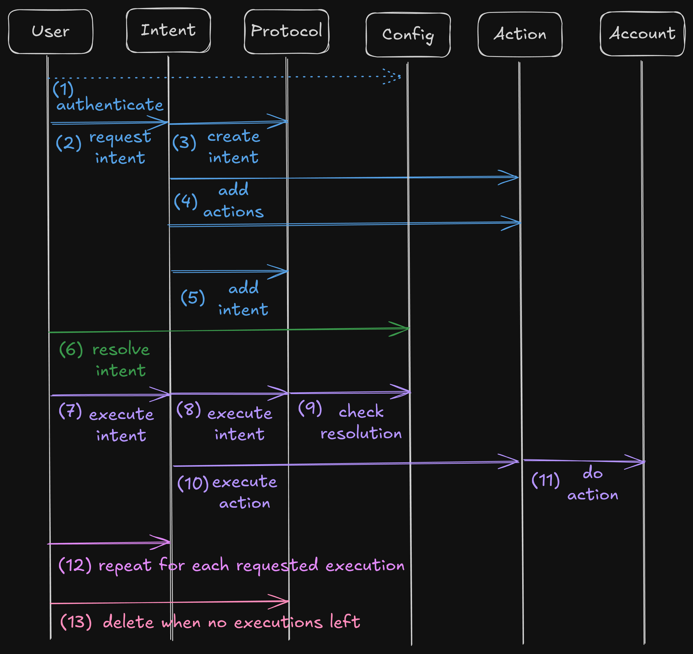

# Implementation

In the following sections, we detail how to implement your own smart account type as well as your own intents and actions, using our macros.

Smart accounts can power (almost) any kind of app. We implemented a Multisig and a DAO version, but it could be anything you can dream of! Think AI agent, shops, gaming accounts, possibilities are endless. account.tech just gives you predefined building primitives that you can leverage in your own Move packages.

In addition to making our new `Account` standard modular (use the Config you want), we also made it easily extensible (add any functionality). We show you how it's done in the following sections.

If you want to use or fork one of the existing implementations, you can find them in our [move-registry](https://github.com/account-tech/move-registry).&#x20;

<figure><figcaption></figcaption></figure>

**Intent Flow**

1. User must authenticate by getting an `Auth` instance in the account config module.
2. Then an empty `Outcome` can be initialized for the intent.
3. A new `Params` struct must be instantiated with the common intent arguments.
4. An intent can then be created via `request_intentname()` functions within intent modules.
5. The intent must be resolved by validating the `Outcome` as defined in the account config module. (e.g. approving the intent to reach a threshold for a multisig)
6. Once the conditions are met, the intent is executed by calling the `execute_intent()` function defined in the config module. An `Executable` hot potato ensuring proper execution is returned.
7. Actions are executed sequentially by passing the `Executable` hot potato to `execute_intentname()`.
8. The `Executable` hot potato must be destroyed via `account::confirm_execution()`.
9. Optionally, if there is no "execution\_times" left, the intent can be removed with `account::destroy_empty_intent()` that returns an `Expired` hot potato.
10. This hot potato must be passed to all the delete functions of the matching actions in order to empty the action bag.
11. Finally, `intents::destroy_empty_expired()` can be called.


These 10+ move calls are all executed within a single PTB, showcasing the strengths of Sui. Our composable design coupled with the power of PTBs make this framework extremely generic.

