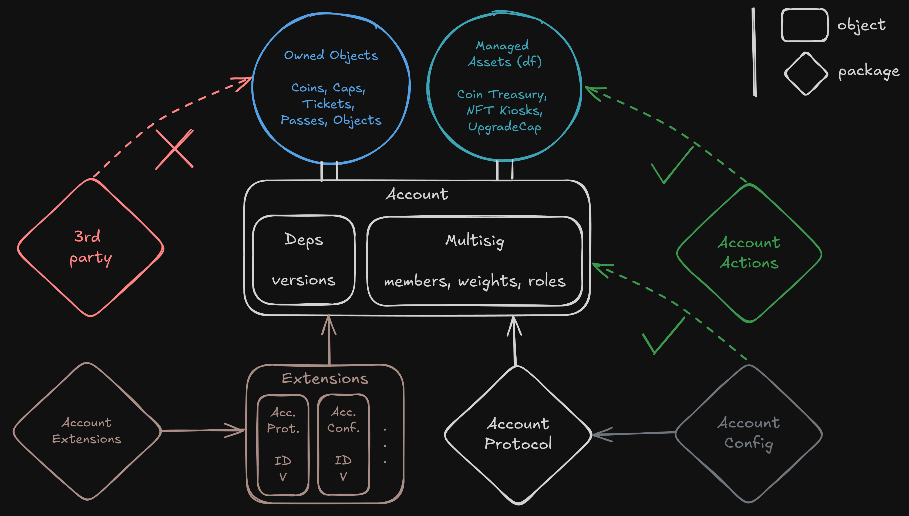

# Concepts

Smart Accounts represent an advanced form of Sui accounts. They are designed with flexible and customizable ownership rules and rich functionality based on intents.

An intent is an on-chain operation that is executed in multiple steps:

* a user creates an intent to execute one or more actions sequentially
* the intent is resolved according to the Smart Account's `Config`
* when the conditions are met, the intent can then be executed by anyone

An action is defined as a unique operation on Sui (withdraw, transfer, etc), represented by structs that are stacked in a heterogeneous map in an Intent. &#x20;

Each Smart Account type has a specific `Config` and its associated intents have a specific `Outcome`.

The `Config` is a struct that contains the "parameters" or "ownership rules" for the Smart Account. It can be anything you want, from a simple threshold to a voting system, to a recovery mechanism.

The `Outcome` is a struct that holds the status of the intent resolution, according to the `Config`. It can be the votes that have been cast, the approvals that have been given, the amount of coin that has been spent, etc.

<figure><figcaption></figcaption></figure>
